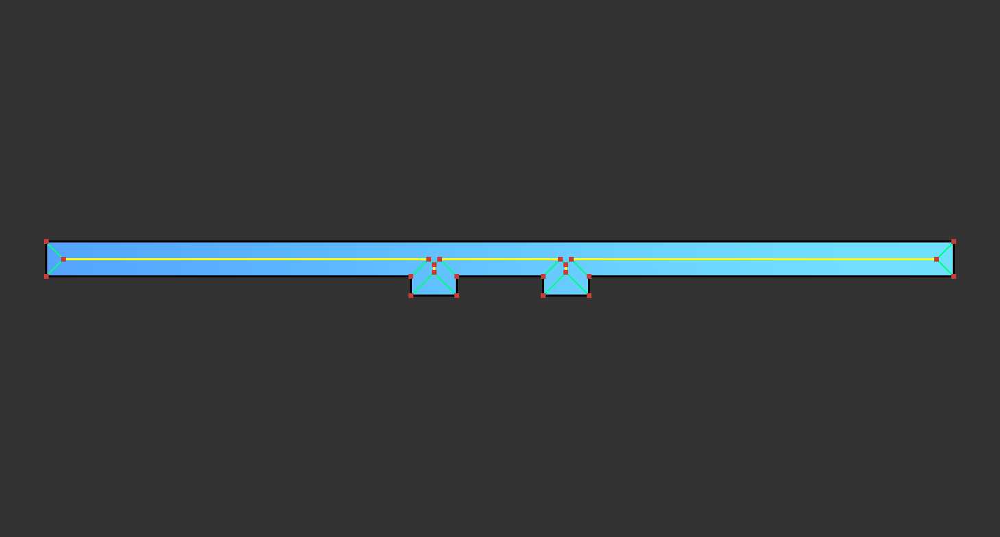
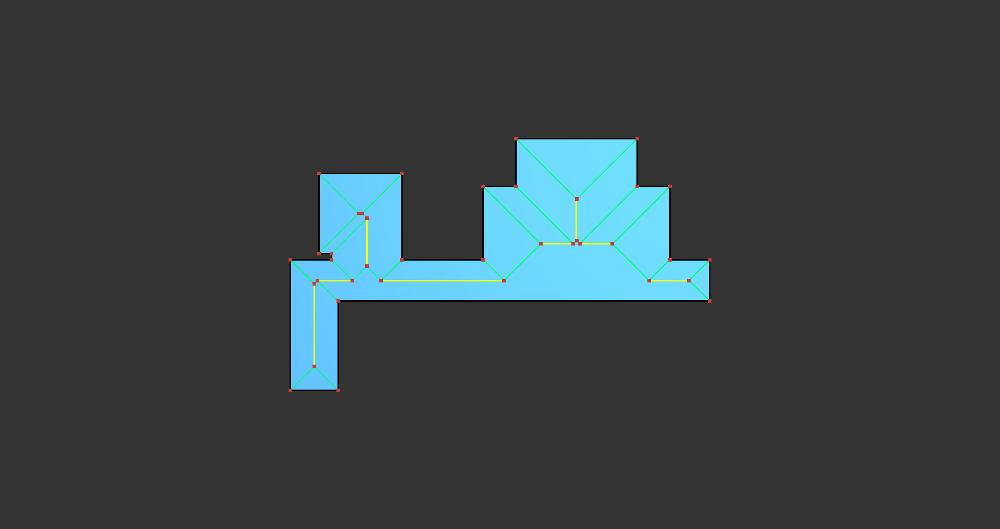
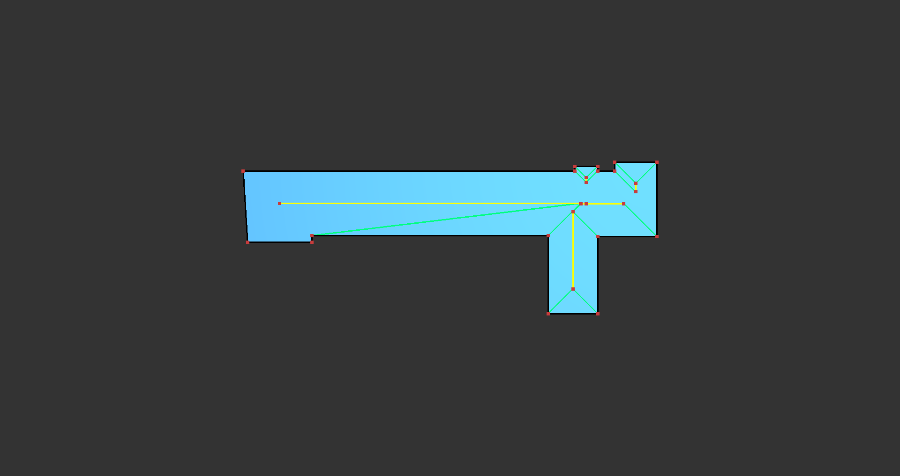

## Changelog (2021.07.07)

- [x] 改正
- [x] 在`append_collision_events`中，改正一边与bisector相交、且两边有公共邻边的情况下的数值稳定性问题。（强制忽略一开始就相交的边的端点轨迹与bisector的交点，因为这个交点不会导致边与bisector脱离）
- [x] 解决多边形相邻点重合导致的问题
- [x] line与ray的CGAL::intersection的tolerance太低，改用line line intersection手动判断
- [x] 已经相交的情况，不应该用原始的ray和bisector的交点与当前交点比较
- [ ] 弧墙仍有一些问题

## Changelog (2021.07.01)

- [x] 增加了对于三条边构成三角形的情况的处理
- [x] 考虑两条边退化后相交于一点的情况，此时也应有赋值
- [x] 排查3号图no intersection的原因

## Update (2021.06.27)

- [x] 采用更简洁方式改写convertKernel;
- [x] 重构接口，将Viewer与库隔离;
- [x] 添加“需定义`PolygonCenterLine_Implementation`宏”的提示;
- [x] 将`PolygonCenterlineSolver`中较长的函数定义放在模板类外;
- [ ] 继续Debug

## Progress

## 目前已知的bug

- [ ] 个别点的end_loc未被赋值；

- [ ] 个别边的两个端点end_loc被放在了同一位置

  

------------------------------------------

# Old

- 上次的问题：没有考虑到可能在

在interval增加一个属性is_endpoint，1表示src沿着中线走，2表示target沿着中线走。
求edge与line的交点。
若端点location均小于等于origin的location，continue。
//（若线段运动方向背对直线，如果依然能相交，说明运动方向偏转超过中线，说明相邻边偏转超过对位边，所以相邻边不会是对位边的相邻边，那么显然这个相邻边更能代表这一点的碰撞，所以不用考虑？）（若两边在中线同侧，则正对中线的一方一定是靠近另一边的一侧先接触中线，而对应的相邻边一定更接近背对中线的边，且角度更接近）
若交点为空：

- 若inner小于0，取target的path；
- 否则取src的path，与bisecter求交点。
- 若交点不存在，则不会相交；
- 否则交点就是相交的起始点。

若交点非空：

- 则交点就是相交区间的起始点。

- 两个端点ray分别与bisector求交点。
  若交点均不存在，则延伸到无穷远；
  若一个存在另一个不存在：若存在的那个是point，则point为结束点；若是ray，则
  若交点落在起始点之前(<=)，则相交区间不存在；
  否则，交点就是相交区间的结束点。

初始化区间。

## TODO

- [ ] 支持Polygon_with_holes
- [ ] 