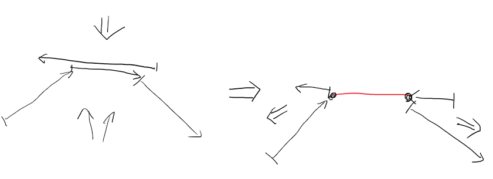
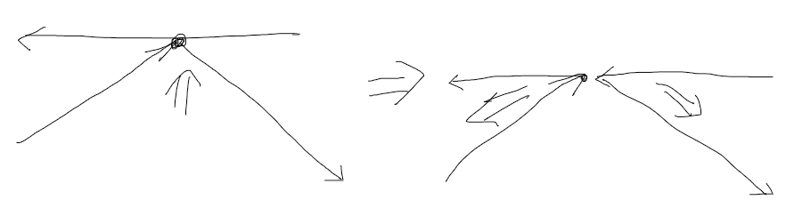
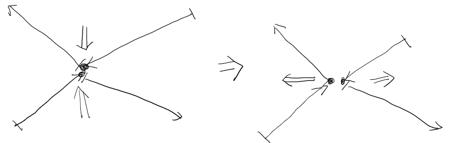
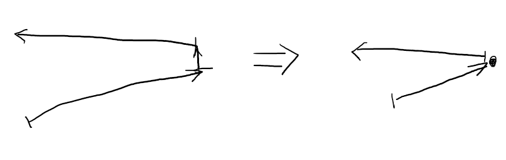

## 大致思路

将原始多边形的每个顶点都施加一个向内侧（即多边形线段方向的左侧）运动的速度，使得每个边沿法线方向运动速度都为1.

对每个顶点都记录运动开始和停止的时间，因此每个顶点的运动轨迹都对应着一个线段。最后，可根据两个线段的夹角决定顶点的运动轨迹是否应该被当作中线。（应该只对夹角超过120°的线段记录顶点轨迹）

- 
  当线段平行相遇的时候，直接将重合部分当作一段轨迹输出到答案，然后根据实际情况决定应该新建多少顶点以及应该如何连接。（对重合部分的两个端点的相遇方式分别进行讨论，以下三种情况都有可能出现)


- 
  当顶点与边相遇的时候，记录顶点的停止时间，然后创建两个新顶点，将线段也拆成两个新线段，然后将新顶点与新线段相连，并为新顶点施加新的速度。
- 
  当顶点与顶点相遇的时候，两个顶点同时停止，并创建两个新顶点，将四个相邻线段重新连接，并施加新的速度。
- 
  顶点与顶点相遇存在一类特殊情况，即相遇顶点的其中一侧只有一条边。此时只新建一个顶点。

### 处理框架

```
优先队列Q，堆顶为最小值;
顶点信息表 point_data_pool[];
边信息表 edge_data_pool[];
答案列表 res_segments[];

在初始情况下，枚举每一对线段A, B{
	如果它们不会相遇，则跳过;
	否则，求出它们的相遇时间t;
	以t为key，将<t, A, B>插入优先队列Q;
}
while Q非空{
	从Q中取出时间最小的事件<t, A, B>;
	若A.is_active()为false或B.is_active()为false，则跳过;
	按照上述规则，设定相关结点的结束时间，并建立新的顶点和线段;
	(对于平行的情况，将重叠片段直接输出到res_segments)
	将新建的顶点和线段分别插入point_data_pool和edge_data_pool;
	对于9中新建的每个线段e1，分别枚举现有的所有线段e2 {
		若e2.is_active()为false，则跳过;
		若e1 e2不会相遇，则跳过;
		否则，求出它们的相遇时间t;
		以t为key，将<t, e1, e2>插入优先队列Q;
	}
}
枚举point_data_pool中的每个顶点p {
	若p为凸点且两侧线段夹角的cos值<=-0.5 {
		将线段<p.start_loc, p.end_loc>插入res_segments;
	}
}
```

### 如何计算两线段相遇时间

对于直线$ax+by+c = 0$，向左的法线方向为$(a, b)$，方向向量为$(b, -a)$。

则对于直线的任意一个垂线上的点，都可以定义一个一维的位置
$$
L(x, y) = (x, y) \cdot (b, -a)
$$
该位置沿着直线的方向递增。

```
线段 A, B;
计算A和B.opposite()所在直线的平分线 bisector; // A和B所在直线的交点轨迹一定在bisector上
// 计算平分线应注意：当两个直线几乎平行但方向相反时，直接用CGAL::bisector计算的bisector容易出现数值不稳定的问题，所以可以对A和B的法线（一个向左一个向右）计算平分线。
若A的向左法线方向与bisector的夹角绝对值大于90°（即内积<0），则将bisector反向。
// 4是为了确保A和B与bisector的交点的运动轨迹沿直线的正方向。

function calc_interval_on_line(bisector, edge){
	若bisector与edge平行{
		则两个顶点轨迹与bisector的交点就是答案。其中，在线段上的location更小的那个作为起始点，更大的那个作为终止点。
		返回答案
	}
	否则:
	计算edge所在直线与bisector交点origin;
	若edge两端点location均小于等于origin的location，跳过; // 此时edge线段运动方向背对直线，如果依然能相交，说明运动方向偏转超过中线，说明相邻边偏转超过对位边，所以相邻边不会是对位边的相邻边，那么显然这个相邻边更能代表这一点的碰撞，所以不用考虑？若两边在中线同侧，则正对中线的一方一定是靠近另一边的一侧先接触中线，而对应的相邻边一定更接近背对中线的边，且角度更接近）
	计算edge与bisector交点x;
	若交点x为空{
		若inner小于0，取target的path；
		否则取src的运动轨迹，与bisecter求交点p。
        若交点不存在，则不会相交；
		否则交点就是相交的起始点begin。
	}
	若交点非空{
		则交点x就是相交区间的起始点begin。 // 注意特判x与edge端点重合的情况，有可能会出现“虽然一开始有交点，但此后edge马上离开bisector”的情况
		两个端点ray分别与bisector求交点p, q。
  		若交点均不存在，则相交区间延伸到无穷远;
  		若一个存在另一个不存在，则存在的那个就是结束点end;
  		若两个交点均存在，取其中较劲的那个作为end;
  	}
}

对于calc_interval_on_line(bisector, A)和calc_interval_on_line(bisector, B)，若两个区间有非空交集，且不属于“两个线段头对头/脚对脚相遇”的情况，则这个区间的begin_point就是相遇的位置。该位置与直线A或B的距离就是开始相交的时间。
```


## 算法接口

- ```c++
  template<typename K, class Poly_with_holes, class Poly>
  struct CenterLineSolver
  {
      vector<Line_2> line_data_pool; // 存放所有原始的边所在的直线。无论之后这些线段怎样碰撞、拆分，分出的线段都仍然在同一条直线上。
      vector<Segment_2> res_segments; // 存放答案，即centerline的线段
      const double CornerCosineThreshold = -0.5; // 决定夹角cos值应小于多少时记录轨迹。(sin值应为正)
      static Vector_2 calc_speed(const Vector_2 &src_vector, const Vector_2 &dest_vector); // 根据两条直线的方向，计算当直线沿法向匀速运动时直线交点的运动速度(含方向)
      
      struct PointData // 用来记录顶点的运动信息
      {
          Point_2 start_loc, end_loc; // 记录起始点和结束点
          FT start_time, end_time; // 该点建立的时间和停止的时间。end_time为0表示暂未终止
          Vector_2 src_vector, dest_vector; // 记录该点前后两条边的方向，用于计算运动速度（也可改成直接保存速度，但还要特判两条边平行的情况）
          PointData *branches[2]; // 记录该点停止运动后建立的新点。
          PointData *prev, *next; // 指向该点在多边形中的前一个顶点和后一个顶点，方便处理多边形的重组操作。
          Vector_2 speed() const; // 返回该顶点的运动速度
          Ray_2 path() const; // 返回以该点的起始坐标和速度构成的射线
          Point_2 new_loc(FT time) const; // 返回该点在time时间运动到的位置
      }; // PointData
      vector<PointData*> point_data_pool; // 保存算法创建的所有PointData结点的指针
      
      struct EdgeData // 用来记录线段的连接信息
      {
          int corr_line; // 对应的初始直线在line_data_pool中的编号。
          PointData *src_point, *dest_point; // 线段的两个端点对应的PointData结点
          EdgeData *prev, *next; // 维护多边形的边的连接关系
          bool is_active() const; // 根据两个端点的end_time是否已经被赋值来判断该线段是否为活跃状态。
          Segment_2 new_loc(FT new_time) const; // 返回该线段在new_time时间运动到的位置
      }; // EdgeData
      vector<EdgeData*> edge_data_pool; // 保存算法创建的所有EdgeData结点的指针
      
      struct Interval // 用来存放区间
      {
          FT begin, end;
  		Point_2 begin_point, end_point;
  		bool is_inf, is_empty; // 右端延伸到无穷远; 空区间
  		// -1/-2: always endpoint; 0: parallel or intersect; 1/2: collision starts at source/target
  		int is_endpoint;
          Interval operator + (const Interval &b) const;
          // 计算两个区间的交集。实际上也排除了“两个线段头对头/脚对脚相遇的情况”
      };
      enum class EventType : std::uint8_t { PARALLEL, NOT_PARALLEL };
      
      struct Event
      {
          FT time;
          EdgeData *a, *b;
          EventType type;
          bool operator < (const Event &b) const; // 用于优先队列的比较
      };
      
      priority_queue<Event> events;
  	FT cur_time; // events最新pop出的事件的发生时间. 初始为0
      
      FT calc_loc_on_line(const Line_2 &line, const Point_2 &point); // 点到line的正交投影在line上的位置。
      bool calc_interval_on_line(const Line_2 &bisector, const EdgeData &edge, Interval &interval);
      void append_collision_events(EdgeData *edge); // 在events中加入与edge相关的相遇事件
      void operator () (const Poly_with_holes& polygon); // 对于polygon计算答案，保存在res_segments中
  };
  ```
  

